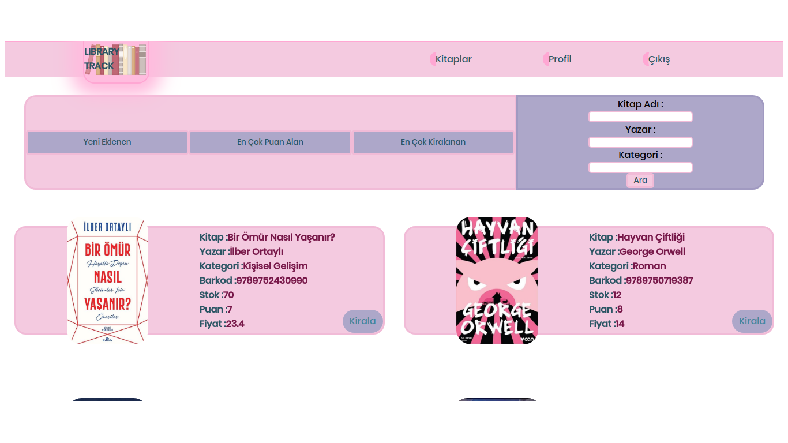

# LibraryTrack - Kitap Kiralama Sitesi

Docker Hub Link: https://hub.docker.com/r/orhanfurkanvurucu/librarytrack

İçerisinde Kaydolma, Giriş Yapma, Google ve Github ile giriş yapma, İki Aşamalı Doğrulama, Şifremi Unuttum, Kitapları en son eklenenler, en çok puan alanlar ve en çok kiralananlar şeklinde sıralama,
kitapları site içerisinde bulunan kredi sistemiyle kiralama, ödeme onaylama ve kitap iade talebini onaylama özellikleriyle beraber kitap ve kullanıcı işlemlerinin yönetimini sağlayan admin paneli özelliklerini barındıran
kitap kiralama sitesi.

Sitenin Front-end kısmı Tolga CANER ve Back-end kısmı Orhan Furkan VURUCU tarafından kodlanmıştır.

Sitenin kodlanmasında kullanılan teknolojiler:
- HTML
- CSS
- Javascript
- Node.js
- ExpressJS
- MongoDB

MVC (Model View Controller) yapısına uygun olarak kodlanmıştır.

Library Track Web Sitesi Linki: https://librarytrack.herokuapp.com/

Library Track API Testi Videosu Linki: https://www.youtube.com/watch?v=SBbJLMqohNM

Library Track Uygulama Videoları:
- https://www.youtube.com/watch?v=ik11eAHV2WI
- https://www.youtube.com/watch?v=zFoLPG5sGQM&feature=youtu.be

